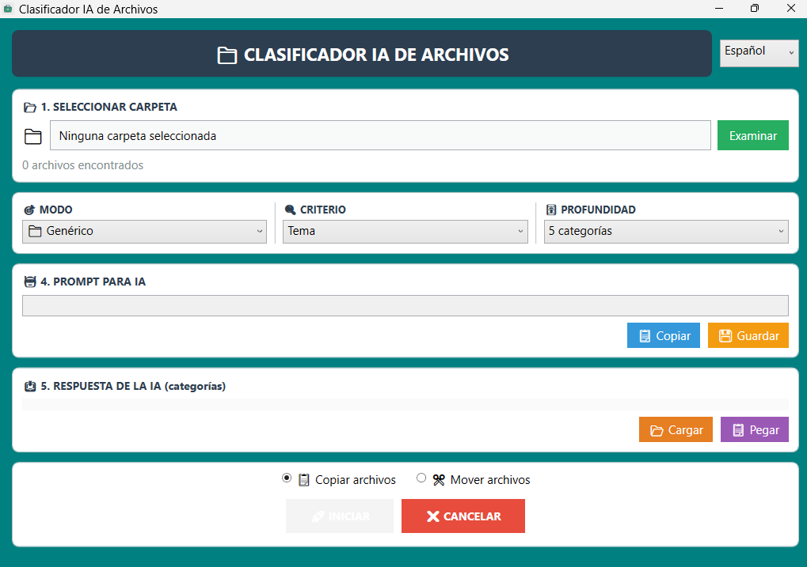

# 🗂️ AI File Classifier

[](LICENSE)
[](https://dotnet.microsoft.com/en-us/download/dotnet/8.0)
[](https://github.com/adriangoodrich/ClasificadorIA/releases)
[](https://github.com/adriangoodrich/ClasificadorIA/commits/main)
[](https://github.com/adriangoodrich/ClasificadorIA/releases)

> A Windows desktop application that automatically classifies your files into themed folders using artificial intelligence (ChatGPT, Claude, DeepSeek, Gemini, and more).

---

## 📸 Screenshots

Main screen



---

## ✨ Features

- 🖥️ **Modern graphical interface** built with WPF — clean design with automatic scrolling that adapts to any window size
- 📁 **Folder selection** via the standard Windows dialog
- 🎯 **Specialized classification modes**:
  - 🗃️ **Generic** — classification by general topic
  - 🎵 **Music** — by genre, artist, era, or album
  - 🎬 **Movies** — by genre, director, year, or franchise
  - 📺 **TV Series** — by genre, platform, or season
  - 📚 **Books** — by literary genre, author, or collection
- 🔢 **Adjustable depth levels**: approximately 5, 10, or 15 categories to control granularity
- 📝 **Smart prompt generation** tailored to the selected mode, criterion, and depth
- 📋 **Copy or save the prompt** as a `.txt` file to paste into any AI
- 🤖 **Compatible with any AI** — ChatGPT, Claude, DeepSeek, Gemini, Mistral, etc.
- 📥 **Flexible response loading** — paste directly from the clipboard or import a `.txt` / `.json` file
- 👁️ **Category preview** showing the number of included files and a listing of the first items
- ⚙️ **Final processing** with the option to **copy** or **move** files into the created subfolders
- 📊 **Floating progress window** with a real-time progress bar and a cancel button
- 🛡️ **Robust filename handling** — normalization of case and special characters to prevent "file not found" errors

---

## 🖥️ System Requirements

| Requirement | Minimum Version |
|---|---|
| Operating System | Windows 10 / Windows 11 |
| .NET Runtime | [.NET 8.0](https://dotnet.microsoft.com/en-us/download/dotnet/8.0) or higher |
| Architecture | x64 |
| RAM | 256 MB |

---

## 🚀 Installation

### Option 1 — Direct download (recommended)

1. Go to the [**Releases**](https://github.com/adriangoodrich/ClasificadorIA/releases) section
2. Download the `.zip` file from the latest release
3. Extract the contents to the folder of your choice
4. Run `ClasificadorIA.exe`

> **Note:** Make sure you have the [.NET 8 Runtime](https://dotnet.microsoft.com/en-us/download/dotnet/8.0) installed before running the application.

---

### Option 2 — Build from source

#### Prerequisites

- [Visual Studio 2022](https://visualstudio.microsoft.com/) or [VS Code](https://code.visualstudio.com/) with the C# extension
- [.NET 8.0 SDK](https://dotnet.microsoft.com/en-us/download/dotnet/8.0)

#### Steps

```bash
# Clone the repository
git clone https://github.com/adriangoodrich/ClasificadorIA.git

# Enter the project folder
cd ClasificadorIA

# Build the project
dotnet build --configuration Release

# Run the application
dotnet run
```

---

## 📖 Usage Guide

### Step 1 — Select a folder

Click **"Select folder"** and choose the directory that contains the files you want to classify.

### Step 2 — Configure the classification

Choose the **mode** that best fits your files (Generic, Music, Movies, etc.), select a **classification criterion**, and adjust the **depth level** (number of categories).

### Step 3 — Generate the prompt

Click **"Generate prompt"**. The application will automatically create an optimized text with your file list and instructions for the AI.

### Step 4 — Copy the prompt and send it to your favorite AI

Use the **"Copy to clipboard"** button or save it as a `.txt` file. Paste it into ChatGPT, Claude, DeepSeek, Gemini, or any other AI of your choice.

### Step 5 — Load the AI response

Once the AI returns the classification in JSON format, go back to the application and either:
- Paste the response using **"Paste from clipboard"**, or
- Import the file using **"Load from file"**

### Step 6 — Review the categories

The application will display all detected categories with the number of files and a preview of the first items. Verify that everything looks correct.

### Step 7 — Apply the classification

Choose whether to **copy** or **move** the files, then click **"Process"**. A progress window will show you the real-time progress. You can cancel the process at any time.

---

## 🛠️ Technologies Used

| Technology | Description |
|---|---|
| [C# / .NET 8.0](https://dotnet.microsoft.com/) | Main language and platform |
| [WPF (Windows Presentation Foundation)](https://learn.microsoft.com/en-us/dotnet/desktop/wpf/) | GUI framework |
| [System.Text.Json](https://learn.microsoft.com/en-us/dotnet/standard/serialization/system-text-json/overview) | Deserialization of AI JSON responses |
| [CancellationToken](https://learn.microsoft.com/en-us/dotnet/standard/threading/cancellation-in-managed-threads) | Cancellation of in-progress operations |

---

## 🤝 Contributing

Contributions are welcome! If you'd like to improve this project:

1. **Fork** the repository
2. Create a new branch for your improvement:
   ```bash
   git checkout -b feature/my-improvement
   ```
3. Make your changes and commit them:
   ```bash
   git commit -m "feat: description of the improvement"
   ```
4. Push the changes to your fork:
   ```bash
   git push origin feature/my-improvement
   ```
5. Open a **Pull Request** explaining the changes made

### 🐛 Reporting bugs

If you find a bug, open an [Issue](https://github.com/adriangoodrich/ClasificadorIA/issues) including:
- A description of the problem
- Steps to reproduce it
- The application version and your Windows version

---

## 📄 License

This project is distributed under the **MIT** license. See the [LICENSE](LICENSE) file for more details.

```
MIT License — Copyright (c) 2024 adriangoodrich
```

---

<div align="center">
  Made by <a href="https://github.com/adriangoodrich">adriangoodrich</a>
  <br><br>
  ⭐ If you find it useful, give the repository a star!
</div>
